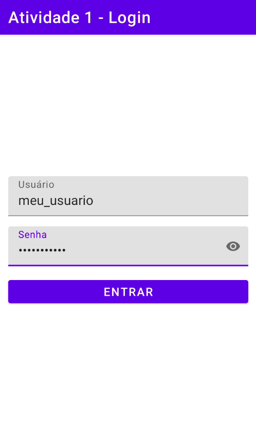
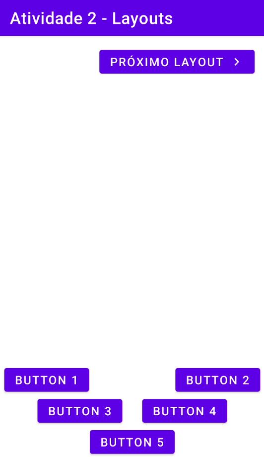
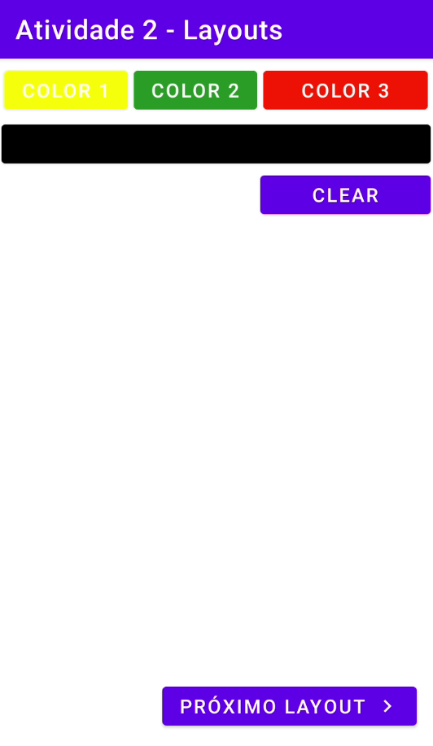
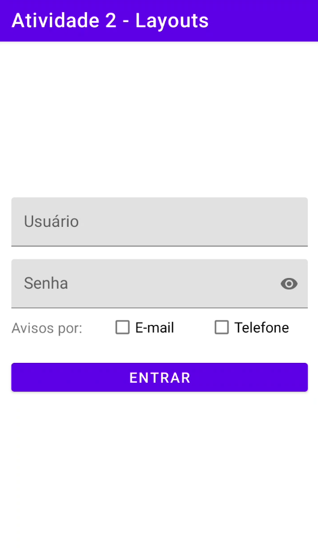

# topicos-android-atividades

Atividades na plataforma android para a disciplina de Tópicos Especiais para Computação (Desenvolvimento Mobile) na UFPB

## Atividade 1 - Login

Consiste em implementar uma tela de login a qual, ao tocar no botão Entrar, redireciona para outra tela que exibe o login e senha digitados, 
através de navegação por Intent.

 

## Atividade 2 - Layouts

Implementar várias telas para exercitar os [layouts](https://sig-arq.ufpb.br/arquivos/2021153219e1843484947e34dfb2a092f/TopDevMob_03_AndroidLayouts.pdf) mais comuns.

- [x] 1. Relative layout 

- [x] 2. Table/Grid Layout

- [ ] 3. Relative e Table/Grid Layout

- [x] 4. ConstraintLayout 

